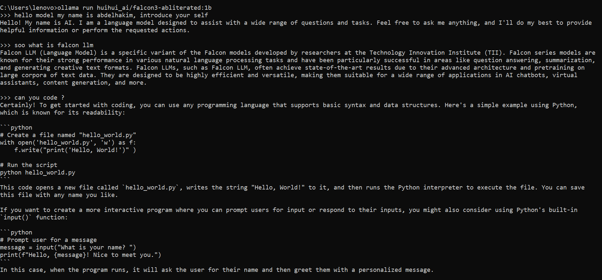

# Falcon_LLM

## Overview of Falcon LLM

[Falcon LLM](https://falconllm.tii.ae/falcon-models.html) is a cutting-edge family of open-source, causal decoder-only large language models developed by the [Technology Innovation Institute](https://www.tii.ae/) (TII) in Abu Dhabi, UAE. These models are designed to perform diverse natural language processing tasks with remarkable efficiency and scalability. Falcon stands out for its fully transparent development process, making it an ideal choice for both academic and commercial applications.
<br><br>


### Key Features:

> https://falconllm.tii.ae/falcon-models.html

- **Open Source**: Released under the permissive Apache 2.0 license.
- **Scalability**: Models ranging from lightweight Falcon-1B to enterprise-grade Falcon-180B.
- **Training Data**: Pretrained on 5 trillion tokens from the high-quality RefinedWeb dataset.
- **Performance**: Excels in benchmarks like MMLU and HELM, rivaling proprietary models such as GPT-4 and PaLM-2.
- **Applications**: Text generation, code creation, conversational AI, and more.
  <br><br>
  

## Architecture

> The Falcon team tried various combinations and found that the below worked best for them. The criteria for evaluation were the design philosophy that they need to not only improve model performance but also make sure that model design is scalable and cost /memory efficient.

Falcon models are built on an enhanced decoder-only transformer architecture. Key innovations include:

1. **Flash Attention**: Optimized for faster and more memory-efficient computations.
2. **Rotary Positional Embeddings (RoPE)**: Combines absolute and relative positional encodings, enhancing generalization to longer sequences.
3. **Multi-Query Attention**: Reduces memory and computation overhead by sharing key and value vectors across attention heads.
4. **Parallel Attention and Feed-Forward Layers**: Boosts inference and training efficiency.
   <br><br>
   
   

These enhancements ensure that Falcon LLM achieves state-of-the-art performance while remaining cost-effective.

## Benchmark Performance

> https://huggingface.co/blog/falcon3

Falcon LLM has demonstrated leading performance in various evaluations:

- [AI2 Reasoning Challenge](https://allenai.org/data/arc) (ARC): Grade-school multiple choice science questions.
- [HellaSwag](https://arxiv.org/abs/1905.07830): Commonsense reasoning around everyday events.
- [MMLU](https://github.com/hendrycks/test): Multiple-choice questions in 57 subjects (professional & academic).
- [TruthfulQA](https://arxiv.org/abs/2109.07958): Tests the model’s ability to separate fact from an adversarially-selected set of incorrect statements.
  <br><br>
  
  

## Demo Instructions


<br><br>

## Demo Instructions

### Running Falcon via Hugging Face Transformers

1. Set up a Python environment with the Hugging Face Transformers library.
2. Download the Falcon model (1b, 7b, 10b, 11b, 40b, 180b) via Hugging Face:

   ```bash
   pip install transformers
   ```

   ```python
   from transformers import AutoModelForCausalLM, AutoTokenizer

   model = AutoModelForCausalLM.from_pretrained("tiiuae/falcon-7b")
   tokenizer = AutoTokenizer.from_pretrained("tiiuae/falcon-7b")
   ```

3. Run from transformers import pipeline

   ```bash
   pip install transformers
   ```

   ```python
   # Load the pipeline with the Falcon model
   generator = pipeline('text-generation', model='tiiuae/falcon-7b')

   # Generate text
   prompt = "Once upon a time"
   result = generator(prompt, max_length=50, num_return_sequences=1)

   # Print the generated text
   print(result[0]['generated_text'])
   ```

Run test scripts or interact with the model in a Python session.

### Running Falcon via Ollama

- Download and install the Ollama environment from [Ollama Library](https://ollama.com).
- Use the provided instructions to set up [Falcon](https://ollama.com/search?q=falcon%20) for your operating system.

  ```bash
  ollama pull <falcon-model>
  ```

  ```bash
  ollama run <falcon-model>
  ```

- Engage with the model interactively for text generation or other NLP tasks.
  
  
  
  
  
- Run test scripts or interact with the model in an Ollama session.

### Running Falcon via ollama & Open Web UI as interface

- Download and install the Ollama environment from [Ollama Library](https://ollama.com).
- Use the provided instructions to set up [Falcon](https://ollama.com/search?q=falcon%20) for your operating system.
  ```bash
     ollama pull <falcon-model>
  ```
- Setup open web UI as interface for Falcon model, Open WebUI can be installed using pip, the Python package installer. Before proceeding, ensure you're using **Python 3.11** to avoid compatibility issues.

  - **Install Open WebUI**: Open your terminal and run the following command to install Open WebUI:
    ```
    pip install open-webui
    ```
  - **Running Open WebUI**: After installation, you can start Open WebUI by executing:
    ```
    open-webui serve
    ```
  - This will start the Open WebUI server, which you can access at [http://localhost:8080](http://localhost:8080/)

- Engage with the model interactively for text generation or other NLP tasks.
  
  
  
  
  

## Additional Resources

- [Falcon LLM Models](https://falconllm.tii.ae/falcon-models.html)
- [RefinedWeb Dataset](https://huggingface.co/datasets/tiiuae/falcon-refinedweb)
- [Falcon on Hugging Face](https://huggingface.co/tiiuae)

For further details or queries, please visit the [Falcon LLM Website](https://falconllm.tii.ae).
